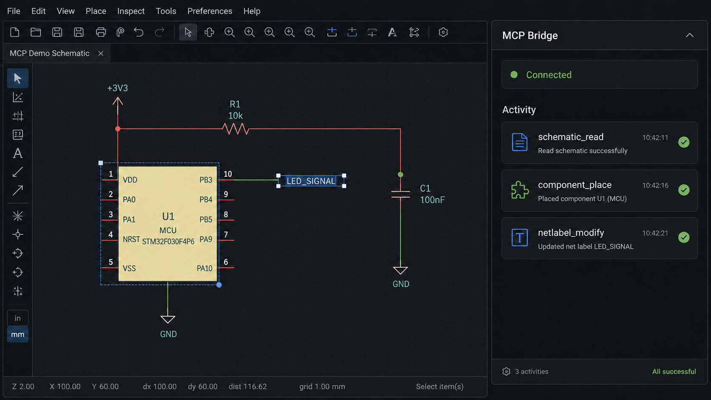

# MCP Bridge 社区版

## 2.3.0

本版本以共享 `contracts/bridge-contract.json` 集中维护 Bridge 工具路由、内部交互路由、超时策略和消息字段契约。处理器注册表在加载时校验每个处理器都已声明；设置页优先使用 MessageBus 接收状态更新，当 MessageBus 不可用时使用持久化最新快照轮询回退。`JLCEDA_BRIDGE_TOKEN` 仍为可选配置。

## 2.1 PCB 工具

`schematic_layout_check` 读取结构化原理图图元并返回稳定 primitive ID、估算矩形、碰撞类型/严重度、密集区域和能力缺失说明。`mode: "fix"` 配合 `confirm: true` 时仅应用属性文本建议位置。

`bridge_select_client` 在已连接的 EDA 页面客户端之间选择 MCP 路由目标。它不会切换同一个 EDA 进程中的可见标签页；如需在进程内切换标签页，请通过 `api_invoke` 调用 `eda.dmt_EditorControl.activateDocument(tabId)`。

Server 通过 `bridge_recover_client` 请求受控恢复时，Bridge 会创建新的运行时世代；底层不可取消 EDA Promise 不会被终止，Server 会在文档身份和只读回读确认前阻止写入。

2.1 版本新增 `schematic_document_action`，用于受限地检查原理图坐标/区域、选中对象、图元、导航、保存和导入。

`schematic_pages_manage` 是受确认保护的页面工作流，可创建、复制、重命名或完整重排原理图页面。重排会使用重新读取的 EDA 页面对象验证完整 UUID 集合和最终顺序；不提供页面删除。

`eda_context` 在已安装的 EDA 提供 0.4.15 API 时返回客户端版本、连接模式、编辑器版本、编译日期和当前画布数据单位。

`eda_canvas_snapshot` 可在不改变文档或视图的情况下返回受限的当前画布图像。

`workspace_query` 读取当前工作区/团队以及受限的可访问工作区、团队、工程和文件夹列表。

`design_source_export` 读取当前文档或封装源文件的受限预览；完整源文本需要明确授权且受字节数限制。

`design_archive_export` 默认返回原生当前工程/当前文档归档元数据，只有明确请求时才包含受限的 Base64 数据。

`library_preview` 将符号和封装资源渲染为受限的 MCP 图像，`library_classification_query` 返回受限的官方库分类树。

`project_info` 可选返回当前工程受限的 Board 和 Panel 清单。

`pcb_document_action` 还支持 PCB 鼠标位置、明确选择以及受限的图元 ID/类型/BBox 查询。

2.1 版本新增 `pcb_drc_check`、`schematic_drc_check`、`pcb_net_query`、`pcb_constraints_query`、`pcb_layer_query`、`pcb_realtime_drc`、`pcb_document_action`、`project_info`、`netlist_compare`、`design_compare`、`manufacture_export`、只读的 `manufacture_templates_query`、`library_sources` 和 `library_search`。网络查询支持完整详情、仅名称列表、官方 `getNet` 精确读取以及精确网络的长度/颜色/图元分析。`component_select` 和设备 `library_search` 支持精确的 0.4.15 属性查询；设备搜索还支持官方单个/批量 LCSC C 编号映射和精确 UUID 获取，符号、封装、3D 模型、可复用模块、Panel 库和仿真模型搜索使用各自支持的 API。仿真模型读取不可用，因为官方 `get` API 需要私有部署。PCB BOM 导出可选择 `manufacture_templates_query` 返回的模板，原理图 BOM 导出可选择装配变体。制造导出包含官方飞针测试文件。`pcb_constraints_query` 返回结构化规则和约束组。`pcb_document_action` 可检查 PCB 坐标、选中/区域图元、过滤器和画布状态，也可导入 Base64 JSON/SES、控制导航/飞线计算，并执行明确请求的受限布线清理。PCB 自动布局/自动布线会等到目标客户端公开并经实页确认对应 API 后再启用。

`pcb_constraints_manage` 是约束组的受确认保护写入工具，支持单个网类、差分对、等长组和 Pad 对组修改，只校验当前操作相关字段并读取验证受影响项目；不支持批量替换规则配置。

当前版本会拒绝显式传入的空 UUID 选择；EDA 操作超时后仍保持修改队列锁定，
直到底层 Promise 真正结束；网络标签修改同时支持普通标签和电源/地网络标识。

> 本扩展不是嘉立创官方插件，也不代表嘉立创或原项目维护者。

本扩展基于 [`sengbin/JLCEDA-MCP`](https://github.com/sengbin/JLCEDA-MCP)
项目中的 **MCP Bridge** 改进，由社区独立维护。社区版使用独立的原生 MCP
Server，通过本机 WebSocket 与嘉立创 EDA 专业版连接，不再依赖 VS Code / Cursor
侧的 MCP Hub 扩展。

主要改进包括原生 MCP 协议、多客户端页面选择、Bridge 凭据保护、语义级原理图读取、
器件放置和网络标签等工具。

当活动页面任务已确认卡死时，MCP 客户端可通过 `bridge_select_client` 的 `force: true`
切换到新的就绪页面。切换会使旧租约的未开始任务失效，但不会取消已经在 EDA 内执行的 API 调用。

## 功能演示



上图展示 Bridge 已连接时的典型工作流：MCP 客户端读取原理图、放置器件并修改网络标签，
嘉立创 EDA 页面负责执行和呈现对应操作。图片为功能流程示意，实际界面以当前 EDA 版本为准。

链路：嘉立创 EDA -> 本机 WebSocket (Bridge) -> 原生 MCP Server -> MCP 客户端。

- 社区仓库：https://github.com/hs150521/JLCEDA-MCP-Community
- 上游项目：https://github.com/sengbin/JLCEDA-MCP
- 社区联系邮箱：hs150521@proton.me

内置专用工具：

**基础工具**

- `schematic_read`：读取当前原理图页面的完整电路语义快照，包含器件列表、引脚网络连接关系与 DRC 检查结果。
- `schematic_review`：读取全工程所有原理图页面的网表文件，覆盖多页电路，适合全局审查、BOM 核查与跨页信号追踪。
- `component_select`：搜索器件候选项并返回确认结果；可直接输入 LCSC C 编号以查询已关联的 EasyEDA 器件。
- `component_place`：引导放置已确认的器件列表。
- `netlabel_place`：电源/地网络创建对应网络标识，其他信号创建普通网络标签。

**透传 EDA API 工具（可选，需在服务端侧边栏开启）**

- `api_index`：列出所有可用的 EDA API 模块名称。
- `api_search`：按关键词搜索具体 API 方法及参数说明。
- `eda_context`：读取当前 EDA 页面的上下文信息。
- `api_invoke`：直接调用任意 EDA API 并返回结果。

## 安装

必须同时安装 EDA Bridge 和原生 JLCEDA MCP Server。本社区版不依赖旧版 MCP Hub。

### 1. EDA Bridge

在嘉立创 EDA 专业版扩展管理器中安装“MCP Bridge 社区版”，重启 EDA，然后打开原理图或 PCB 页面。

### 2. 原生 MCP Server

从同一 Release 下载匹配的 `jlceda-mcp-server-2.3.0.tgz`，执行：

```powershell
npm install --global .\jlceda-mcp-server-2.3.0.tgz
```

安装后的命令为 `jlceda-mcp`。源码构建及其他客户端配置见[原生 MCP 安装说明](https://github.com/hs150521/JLCEDA-MCP-Community/blob/main/docs/native-mcp-setup.md)。

Codex 可运行：

```powershell
codex mcp add jlceda --env JLCEDA_BRIDGE_PORT=8765 -- jlceda-mcp
```

Claude Desktop、Claude Code、Cursor 等客户端应将 `jlceda-mcp` 注册为本地 STDIO MCP Server。

### 3. Bridge 地址

默认地址为 `ws://127.0.0.1:8765/bridge/ws`。若设置 `JLCEDA_BRIDGE_TOKEN`，EDA 设置页地址必须携带同一个 token。不要公开 token 或包含 token 的截图。

## 安全、兼容性与已知限制

- Server 仅监听 `127.0.0.1`；推荐配置 Bridge Token。
- MCP 工具能够修改当前工程。操作前请保存工程，并审查 AI 提议的写操作。
- `api_invoke` 是可选的 API 透传能力，只应在信任的 MCP 客户端中启用。
- 已在嘉立创 EDA 专业版 3.2.181 上测试；其他 3.x 版本需自行验证。
- `createNetLabel` 属于 Alpha API；3.2.181 中普通网络标签创建可能超时。Bridge 会明确报告失败并释放任务队列。
- 扩展只在原理图或 PCB 页面建立 Bridge 连接。

## 状态说明

连接设置页面展示两行状态，每秒自动刷新：

- **第一行（桥接状态）**：活动页面显示"已连接"；待命页面显示"当前活动客户端：xxx"；连接失败显示"连接失败"。
- **第二行（WebSocket 状态）**：正在连接时显示"连接中"；连接成功后显示"当前客户端：xxx"；连接失败时显示具体错误原因。

仅在原理图或 PCB 页面可连接，连接失败后系统会自动重试。

## 交互与注意事项

1. 写操作前保存工程，并确认活动项目和页面正确。
2. `component_place` 会启动 EDA 内的交互放置；`component_place_auto` 才会按坐标直接创建。
3. 多个 EDA 页面同时连接时，应先枚举客户端并明确选择目标页面。
4. 修改端口或 token 后，必须同步更新 MCP Server 环境变量与 Bridge 地址。
5. 普通网络标签创建失败时不要改用电源网络标识代替；请查看 Bridge 调试日志。
6. 状态异常时先关闭旧版 MCP Hub，再重启 AI 客户端与 EDA Bridge。
## 常见问题

### 聊天里看不到工具怎么办？

请在聊天客户端确认该 MCP 服务已被信任，并检查工具开关是否开启。

### AI 读不到当前图纸内容怎么办？

EDA 页面可能未桥接成功，请回到连接设置页确认连接状态是否正常。

### 保存地址后仍无法连接？

请确认原生 MCP Server 已安装并由 AI 客户端启动，且端口、token 与 Bridge 地址一致。

## 许可证

本扩展采用 [Apache License 2.0](LICENSE) 许可证。
数据处理说明见 [PRIVACY.md](PRIVACY.md)。
