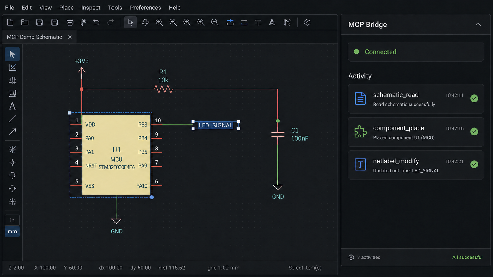

# MCP Bridge 社区版

## 2.3.8 共享封装源保存

新增 `footprint_save`：在当前独立封装文档调用一次 `sys_FileManager.getDocumentSource()`，核对同库/文档/标签及连接、活动角色、租约后，调用一次 `lib_Footprint.updateDocumentSource(documentUuid, libraryUuid, source)`。源码原样留在 EDA 内，保存不额外读取七类图元，也不会自动关闭页面或重建器件。仅支持可选 `timeoutMs`（5–120 秒，默认 30 秒）。该操作更新共享库源，可能影响所有引用实例，不提供仅此实例的封装重绑定。

`saved:true`、`saveAcknowledged:true` 仅表示库写入成功 ACK；返回 `scope:"library_source"`、`sharedSource:true`、真实身份和 `sourceLength`。ACK 后换页或身份读取失败时仍保留两个 true 值，同时返回 `ok:false`、`identityVerified:false`、`reason:"footprint_changed_after_save"`。显式 false/undefined 只表示未获 ACK，不能当作源码未改变；RPC 未确认或超时保留未知提交，按同库同文档的完整 `footprint_read` 恢复。恢复快照证明编辑状态，不补充保存及引用 PCB 持久性结论。

EDA 3.2.181 / API 0.3.15 与匹配 Server/活动 Bridge 2.3.8 的自建共享封装实测通过：Via 0→1→0，两次保存获 ACK；封装冷重开完整 DTO 保持创建状态并最终严格恢复基线，引用 PCB 冷重开也为 Via 0→1→0，其他读取部分保持基线。本轮按此范围收口 #80；板级子过孔删除本身仍不保证持久。Bridge 完整 `npm run build`、`npm run lint` 及匹配 Server 全量 test/lint/多客户端验证通过，ACK 后身份失败和未知保存恢复分支仅由本地回归验证。详见 [2.3.8 发布说明](../docs/releases/v2.3.8.md)。

## 2.3.7 原理图导线与网络标签

本轮 Bridge 完整 `npm run build`（含新网络标签回归、typecheck、API 文档/runtime 验证和打包）及 `npm run lint` 已通过；匹配 Server 的 `npm test`、`npm run lint` 和 `node verify-multi-client.mjs` 也已通过。匹配 2.3.7 的网标预检和导线新功能已实测通过；原 TPS552892 布局仍缺 fixture，不据此宣称匿名网络合并的宿主根因已解决。

raw `api_invoke eda.sch_PrimitiveWire.create` 与受控 `wire_create` 共用当前图页接触预检和写后逐段覆盖核对。保留官方 `line/net/color/lineWidth/lineType` 五参数，以及单路径 `number[]`、多路径 `number[][]`。仅该 raw API 可在 payload 顶层选填 `allowedWireIds`；默认不允许接触旧导线，不同已命名网络混接也会在原生调用前拒绝。

创建回读要求实际导线完整覆盖全部请求线段，且覆盖路径上存在本次新增或改变的有效导线，兼容旧 ID 延伸及正常拆分/合并，返回 `confirmedPrimitiveIds` 和兼容的 `confirmedPrimitiveId`。未完整覆盖、未许可的旧导线变化或回读失败保留 `commitUnknown:true`，须以 `schematic_read includeConnectivityPrimitives:true` 完整回读同页连接图元和语义网表。诊断要求宿主重启时，先重启原 EDA；仅查上下文不能解除隔离。此核验不证明宿主已避免所有匿名网络合并，#22 原场景仍待实机核对。

自建原理图实测中，未许可旧线接触和跨命名网络均被拒绝；授权后五参数、多路径、小写请求名创建合并旧 ID 并完整覆盖两段路径，匿名线附近短延伸也完整覆盖。完整原生 JLCEDA 网表、3 个普通器件 DTO、无关命名/匿名导线及端口/标识/标签均保持基线。#22 原 TPS552892 布局与宿主根因仍缺 fixture，不据此自动关闭。

raw `eda.sch_PrimitiveAttribute.createNetLabel` 复用普通网络标签的版本预检：已知 EDA 3.x 返回 `EDA_VERSION_UNSUPPORTED`、`commitStatus:"not_started"`、`nativeCallAttempted:false`，不启动原生写入或未知提交隔离；API 索引明确从 EDA v4 起提供。4.x 与版本未知时保持原生调用，电源/地 NetFlag 不受影响。EDA 3.2.181 与匹配 2.3.7 实测中，raw/semantic 普通标签创建均被版本预检阻止，前后完整连接读取不变；9 个混合版本客户端 ready、心跳正常，2.3.6 待命客户端完整读取也不变。本轮修复 #26 已知 3.x 触发路径，不泛称宿主内部全部失联已根治，EDA v4 未实测。详见 [2.3.7 发布说明](../docs/releases/v2.3.7.md)。

名称属性查询的所有页固定使用关键词搜索，并在本地核对全部请求属性，返回 `searchImplementation:"keyword_name_filter"`；`mayHaveMore` 仍依据原生候选页，避免每页切换搜索后端。裸器件引用明确指定库时，同时核对返回记录的器件 UUID 与库 UUID，不一致则在创建前返回 `DEVICE_LOOKUP_MISMATCH`。

## 2.3.6 独立封装编辑

Bridge 将官方 `getCurrentDocumentInfo()` 返回的 `documentType:4` 识别为 `pageKind:"footprint"`，身份包含 `documentUuid`、`pageUuid`、`libraryUuid` 和 `tabId`；其中 `pageUuid` 为该封装文档 UUID。库身份优先取匹配当前文档的实际 `<documentUuid>@<libraryUuid>` 标签；含 `@` 但文档前缀不符或库 UUID 缺失时拒绝，无 `@` 的旧式标签兼容当前文档的 `parentLibraryUuid`。EDA 3.2.181 跨库切换时该字段可能滞留旧值，不能覆盖匹配当前文档的实际库标签。独立封装可建立连接，无需工程 UUID；已有 PCB 或工程缓存不作为封装身份。`eda_context` 返回 `footprintContext`，`bridge_clients` 显示同一组身份。

先调用 `footprint_read` 获取当前文档全部图元。仅支持可选 `timeoutMs`（5–120 秒，默认 60 秒），不支持 sections 或过滤；成功结果包含 `scope:"current_footprint_document"`、`complete:true`、七类数组及数量。Pad 保留焊盘/孔形状、孔偏移、孔旋转和 `padType`，Polyline 保留原生 `polygonSource` 数组，Attribute 保留父 ID、key/value、显示状态及可为空的坐标。对象与全 ID 清单不一致、必要 getter 缺失、读取中换库/文档/标签或超出 10000 图元/8 MiB 时返回 `complete:false`，不会以截断数据声明完整。

无孔 Pad（`hole:null`）的原生 `holeRotation` 为 `null`、`undefined` 或数值 NaN 时，DTO 明确返回 `null`；有限值原样保留，带孔状态仍要求有限孔旋转。`specialPad:[]` 表示没有额外特殊轮廓，原样保留；`pad` 或 `specialPad` 至少有一个真实非空形状，必要 getter 和焊盘/孔形状检查仍保留。同库同封装 3 个 Pad、1 个 Via、1 个 String 的 `complete:true` 快照、正式受控恢复，以及原生源码写回后重开的 5 个完整 DTO 一致已实测通过。最终 SMD x130/y80、60×60 状态已再次源码写回并关闭重开，5 个完整 DTO 一致。

启用透传 API 工具后，`api_invoke` 支持以下首批封装画布方法，共 21 个读取方法和 20 个写入方法：

| 原生模块 | 读取 | 写入 |
| --- | --- | --- |
| `pcb_PrimitivePad/Via/Line/Arc/Polyline/String`（六个模块） | `get`、`getAll`、`getAllPrimitiveId` | `create`、`modify`、`delete` |
| `pcb_PrimitiveAttribute` | `get`、`getAll`、`getAllPrimitiveId` | `modify`、`delete` |

方法名使用完整路径，例如 `eda.pcb_PrimitiveLine.modify`。参数按当前官方签名传入；修改/删除目标须来自本次实际回读的 ID。Polyline 创建可传原生轮廓源数组，修改可传 `polygonSource`；Bridge 转换成 `pcb_MathPolygon` 对象后调用。`get`、`getAll` 及创建/修改后的 `after` 使用完整 DTO，`getAllPrimitiveId` 返回 ID 列表；`identityVerified:true` 只表示操作前后库、文档和标签一致，字段值应以实际 `after` 为准。七类 `modify` 等待一次 `done()` 后重新读取，字段未生效时返回 `ok:false`、`reason:"native_footprint_modify_incomplete"`、`fieldMismatches`（field/requested/actual）和真实 `after`；已完成且完整回读可确认的差异不触发未知提交隔离。Polyline 的等价闭合轮廓方向、起点及已有精度规范化不误报字段差异，仍保留原生 source。删除返回 `deletedIds` 和 `remainingIds`。

封装编辑器拒绝 PCB/原理图专用工具和未列入首批范围的画布 API。官方 `pcb_PrimitiveAttribute.create` 为内部空实现，因此不开放；库资源查询及 `lib_Footprint.openInEditor` 等全局 API 保持通用调用方式。写入前最后一次身份检查后立即核对连接、活动角色和租约，切换客户端或断连会停止尚未开始的原生写入。

封装写入返回 `commitUnknown:true`、超时或中途失联时，按 `bridge_clients` 的诊断先执行 `bridge_recover_client action:recover`。诊断要求宿主重启时，重启原 EDA 并打开同库同封装文档；使用恢复会话后的全新客户端做 `action:readback`，指定 `readbackPath:"/bridge/jlceda/footprint/read"` 和 `readbackPayload:{}`。Server 核对执行时库/文档身份、七类完整状态及本次回读前后的标签。重开后的新 `tabId` 可以不同于旧任务，但同一次回读不能换标签；仅查询 `/context` 无法解除该隔离。

Via/Line/Polyline/String/独立 Arc 新案例的创建、修改和删除已实测通过。SMD Pad 位置改到 x130 生效，但 80×60 形状请求仍为 60×60，返回已知部分结果；首次 layer3 水平弦 Arc 未登记，具体原因未确定。Attribute 没有实际非空样本，未进行 native 修改/删除验证。个人封装的 5 个控制图元持久回读不能证明 PCB 封装子过孔持久删除（#80），2.3.6 当时未收口该 Issue。封装菜单可见，菜单重启后新客户端 ready、公开选择与 count5 完整回读通过；就绪报告发送失败后的重连分支仅由本地 fixture 验证。发布状态以同版本 GitHub Release 及关联 PR 为准，EDA v4 未验证。详见 [2.3.6 发布说明与回归清单](../docs/releases/v2.3.6.md)。

## 原理图 raw 创建位号保护

`api_invoke eda.sch_PrimitiveComponent.create` 现在复用自动放置的当前页位号基线和恢复流程：恢复被原生创建重排的已有位号，保留 BOM 扩展属性并回读新图元。成功返回 `designatorChanges`、`restoredDesignators`；无法确认恢复时给出 `needsReview` 或未知提交诊断。未知提交沿用 placement 恢复，须读回原页完整 ID、位号及 BOM，不能仅查上下文。完整 DeviceItem、DeviceSearchItem、SymbolItem、SymbolSearchItem 与正式库引用保留原生重载和参数；实机新件的 BOM/PCB false 保留，已有 9 件完整 DTO 不变；本次未发生位号重排，`restoredDesignators:[]`。U4/U5 重排后的恢复、显式 false 参数与恢复超时由本地回归验证。

## 2.3.5 发布检查记录

稳定版 [2.3.5](https://github.com/hs150521/JLCEDA-MCP-Community/releases/tag/v2.3.5) 已发布，GitHub 发布状态以 Release 页面为准。两轮本地全面审查、Bridge/Server 全量构建测试及 lint 已通过，2.3.5 的发布实机验证使用匹配的 Server 与 Bridge。器件批量放置、NC 切换、名称筛选、NetPort Name 查询、原理图导出，以及 PCB BOM、板框、区域、直线覆盖、旋转、属性、元数据和覆铜重建已实测通过；过孔创建/修改、工程库来源核对、覆铜等价轮廓创建/修改及真实 DRC 28 条详情的 14 页连续读取均已实测通过。安装包的可用状态以 [GitHub Release](https://github.com/hs150521/JLCEDA-MCP-Community/releases) 为准。完整 Issue 矩阵见 [2.3.5 验证记录](https://github.com/hs150521/JLCEDA-MCP-Community/blob/v2.3.5/docs/issue-validation-2.3.5.md)。

发布审查补修：普通 Pin 与 ComponentPin 按实际执行路径区分超时恢复；ComponentPin 仍要求所属器件全部引脚的完整回读。直线拆分/合并核验记录同网络、同层写前快照，要求本次新增或改变的有效线路，并返回 `changedPrimitiveIds`。过孔修改核对实际外径大于孔径，量化后的零环宽返回实际状态与差异。

普通 Pin 与 ComponentPin 共用原生 RPC 未确认分类；WebSocket is not open、transport closed、ECONNABORTED 等断连结果均返回 nativeCallSettled:false，并要求原宿主重启后完整回读。已结束但状态不匹配的调用仍区分为 nativeCallSettled:true。三种断连在两条实际处理路径、宿主重启策略与状态漂移分支均有针对性回归，已通过两轮本地复查。 同样统一图页导航与 PCB 直线/过孔创建的断连分类；回归包含原生状态已改变后才抛错的场景，继续要求宿主重启。

2.3.5 改进器件库引用解析、真实 ComponentPin 的 NC 修改、覆铜逐实例重建、PCB 等价几何回读、器件部分修改诊断、PCB 属性文字输入校验、制造导出分支格式校验、DRC 详情分页和非字符串错误传输。原生未解决项及待验证场景见下文。

`wire_create` 与 raw 导线创建均逐段核对实际覆盖，不能只凭返回 ID 或局部旧线变化报告成功。`confirmedPrimitiveIds` 给出参与覆盖的实际导线，`confirmedPrimitiveId` 保留单 ID 字段；返回的 `net` 是按原生大写规则归一后的请求名，未指定时为 `null`。随后须以 `schematic_read includeConnectivityPrimitives:true` 核对同页实际语义连接；无法确认完整路径时保留 `commitUnknown`。该读取也可用于其他常规连线核查和受控恢复。

`schematic_component_edit` 的几何修改会检查匿名导线连通组，同组内移动保持成功；引脚脱离或转移到另一组时报告 `pin_network_changed` 和前后组 ID。`schematic_read` 可用 `timeoutMs` 延长大图页读取预算至 120 秒。

2.3.4 新增 Board 建立工作流，可自动创建一对关联的原理图和 PCB，或将现有游离原理图关联到新 PCB。此前 2.3.3 扩充了原理图和 PCB 的完整读取与受控编辑，新增 `editor_navigate` 以打开或激活当前工程的图页，并针对复制页共享 ID、交互放置结果和无网络 PCB 图元改进回读。工具路由和消息字段仍由共享 `contracts/bridge-contract.json` 管理；`JLCEDA_BRIDGE_TOKEN` 为可选配置。

Bridge 会记录任务开始、完成、返回失败、异常和超时的结构化日志，包含工具名、路由、可用的 EDA API 名称、请求 ID、执行阶段以及版本与构建日期水印。菜单“查看调试日志”展示最近 100 条简略报告并隐藏异常堆栈；扩展本地存储保留最近 200 条完整日志。清空日志后，其他已打开页面的后续读取不会恢复旧记录。

配套的 MCP Server 2.3.5 提供连接失联后的写入诊断和同图页恢复回读，并公开 Board 建立、原理图导线预览、创建及 NetPort 操作。

交互放置检查可能清理完全重叠的重复器件。若清理、坐标放置或 `api_invoke eda.sch_PrimitiveComponent.create` 的位号恢复结果不明，`commitUnknown:true` 会隔离后续写入；恢复时通过 `api_invoke` 调用 `eda.sch_PrimitiveComponent.getAllPrimitiveId`，传入 `args:[null,false]` 和 `includeCompleteSchematicComponentIds:true`，可获取不截断的当前图页 `schematicComponentIds`、`schematicComponentStates`（ID、位号与 BOM 扩展属性）及数量，供 Server 核对原图页。

## 2.3.5 回读与操作说明

### 器件库、引脚与原理图检查

`component_place`、`component_place_auto` 及原理图设备引用创建在客户端提供 `lib_Device.get()` 时先读取设备库，将有效裸引用解析为完整 DeviceItem 后调用原生创建；找不到设备时返回 `DEVICE_NOT_FOUND` 且不启动创建。完整 DeviceItem/SearchItem 与符号引用保留各自原生重载；客户端未提供设备查询时保留裸引用的原生兼容路径。单子件设备可自动采用唯一的 `subPartName`。33 字符的错误设备 UUID 与其正确 32 字符系统库记录已区分。2.3.4 实机一次性图页中，通过 `lib_Device.get()` 的完整 DeviceItem 与唯一 `subPartName`，连续创建 0603 C23221 及 0805 C96346/C84376/C110775；四次原生创建各约 1–2 秒，`schematic_read` 完整回读确认 4 件且无写入隔离。2.3.5 实机中，无效 UUID 立即返回 `DEVICE_NOT_FOUND`；随后 `component_place_auto` 的上述 4 型号批次全部成功，合计约 8.9 秒。

设备 `library_search` 的 `properties.name` 搜索会精确核对实际返回名称；各页固定使用关键词搜索并同时核对全部请求属性，返回 `exactNameVerified`、`searchImplementation` 和 `excludedNameMismatches`。2.3.5 最终实机以 limit:1 连续查询两页，分别返回 1 条精确匹配和空页，均采用 keyword_name_filter，第二页 mayHaveMore:false。这些结果仍受原生分页范围限制。

`api_invoke` 调用 `eda.sch_PrimitivePin.modify` 时，若目标为当前页器件的 ComponentPin，Bridge 改用真实实例的 `toAsync()`、`setState_NoConnected()`/`setState_PinNumber()` 和 `done()`，只支持 `noConnected`、`pinNumber`。提交前后核对该器件各引脚状态；不会为 NC 修改重写符号引脚几何。失败恢复归为 `schematic_connectivity_primitives`：使用 `bridge_recover_client action=readback`，指定 `readbackPath:"/bridge/jlceda/schematic/read"`、`readbackPayload:{"includeConnectivityPrimitives":true}`。语义快照包含 `pinId`、`x`、`y`、`rotation`、`noConnected`，恢复时须核对目标所属器件全部引脚的真实状态；仅查询 `/context` 不会解除隔离。诊断要求宿主重启时先重启原 EDA 宿主。2.3.5 实机对同一 ComponentPin 的 NC `true`→`false` 两次均 `verified:true`，目标坐标与同器件其他引脚均保持不变。失败后的恢复路径已有本地回归，未在该成功场景中触发。

`schematic_document_action` 依据父图元属性查询与按 ID 查询纠正绑定属性类型，保留真实父 ID、键、值和几何。无参数 `sch_PrimitiveAttribute.getAll()` 只返回独立属性；带父图元参数的 `getAll(parentPrimitiveId)` 与 `get([primitiveId])` 可读取绑定的 Name Attribute。2.3.5 最终实机类型查询、单件读取和批量读取均将 NetPort Name 返回为 Attribute；单件与批量结果的父 ID、Name 值和坐标一致。现有点导线转换为多线段路径会在原生修改前返回 `point_wire_path_conversion_unsupported`，并给出 `before`、`requested`；需要该路径时，新建导线、核对几何及网络，再显式删除原点导线。写后几何不匹配会返回实际 `after`。

`manufacture_export` 仅在选定 `domain` / `kind` 的分支计算参数和校验格式，避免其他导出分支提前触发不相关校验。BOM 使用 CSV/XLSX，图纸文档使用 PDF/PNG/SVG，标准与仿真网表分别核对自身 `netlistType`；PCB BOM 及其他制造导出同样使用自己的分支。2.3.5 实机原理图 BOM CSV（740 B）、JLCEDA 网表（18,883 B）、PDF 文档（35,886 B）与 PCB BOM CSV（334 B）均生成成功；其他导出类型仍按验证记录逐项核对。

### PCB 原生归一化与诊断

`pcb_component_edit` 按模 360 度核对旋转，因此 `-90` 与 `270` 等价，成功结果可包含 `normalization.rotation`；2.3.5 实机修改 `-90` 后回读 `270` 已验证。实机 `supplierId` 与 `otherProperty` 修改也已按实际状态验证。元数据部分写入不匹配时，返回实际 `after`、`failureKind:"state_mismatch"`、`mismatches`、`mismatchCount` 和 `mismatchesComplete`；`nativeCallSettled:true` 表示原生调用已结束。该失败仍保留 `commitUnknown` 和受控回读要求，按诊断核对后再决定后续操作。创建时若原生将设备或封装复制进工程库，须以创建返回的来源引用与请求来源或同 ID 回读的一致性确认，返回 `normalization.source`；实机创建已核对新 ID、实际位置、270° 旋转与工程库来源引用。

`pcb_board_outline_manage` 的闭合轮廓比较支持等价起点循环移动与方向反转；开放折线路径只接受完整路径反向，不接受循环换起点。`pcb_region_manage` 比较已闭合的区域轮廓，允许等价起点及方向变化；多点轮廓写入须显式首尾闭合。比较保留圆弧/曲线语义。对 EDA 3.2.181 已观察的四位小数坐标回读，使用每坐标 `0.00005 mil` 容差；真实几何差异仍报告不匹配。返回值保留实际轮廓及归一化诊断。2.3.5 实机板框反向回读、显式闭合区域反向及四位小数坐标回读均已验证。

`pcb_connectivity_action line_create` 可核对端点反向，以及原生拆分/合并后同网络、同层、同宽的共线图元是否覆盖请求线段；结果返回实际 `primitiveIds`、`returnedPrimitiveId`、`after` 和 `normalization`。2.3.5 实机共线覆盖回读返回 2 个实际 ID 并验证成功。`via_create` 与 `pcb_routing_edit` 过孔尺寸修改只接受精确尺寸或 EDA 3.2.181 实测的 0.2 mil 网格最近值（`round_0_2_mil`），返回请求值、实际孔径/外径与归一化方式，位置和网络仍须匹配；创建与修改已实测通过：15.748/31.496→15.8/31.4、15.7/31.5→15.8/31.6。

`pcb_routing_edit` 删除过孔前检查原生网络图元：已知父器件 ID 时返回 `footprint_owned_via` 且不调用删除；缺少父字段时返回的归属为未知。删除后目标从完整 ID 列表消失，只证明当前页内存已删除，结果带 `verificationScope:"current_page_memory"`、`durableDeletionVerified:false`、`requiredPersistenceVerification:"save_and_reopen_pcb"`。板级删除本身不保证持久；需要共享源修改时，在实际独立封装中编辑并 `footprint_save`，再冷重开封装和引用 PCB 完整核对，不支持仅此实例封装重绑定。

`pcb_pour_manage rebuild` 优先使用批量 `rebuildCopperRegions()`；缺少批量方法时尝试目标实例的 `rebuildCopperRegion()`。两者均不可用则返回 `reason:"unsupported_capability"`、`errorCode:"EDA_CAPABILITY_UNAVAILABLE"`、缺失 API 和可用的 EDA 版本，明确 `applied:false`。2.3.5 实机全板重建已验证 1 个边框与 1 个填充；批量、实例回退和能力缺失分支另有本地回归。创建或修改允许闭合轮廓等价反向、起点变化及已观察的四位小数回读，返回实际轮廓与 `normalization`；实机创建与修改均确认反向和四位小数轮廓等价；实际优先级副作用另行报告。`pcb_text_manage` 的 Attribute 修改支持 `property.value` 和 `property.valueVisible` 通过 Server 校验，实机两字段修改及实际回读已验证。

### DRC 分页与错误传输

`pcb_drc_check` 支持非负整数 `offset` 与 1–500 的 `limit`，默认每次最多 120 条详情。按照返回的 `nextOffset` 继续读取，直到该字段不再返回。结果包含 `totalAvailableDetails`、`returnedDetails`、`nativeTruncated`、`serializationTruncated` 和 `truncated`；分页只能覆盖原生提供的详情，不能补出原生未返回的错误。真实分类树按叶子明细分页；含 28 个错误的 PCB 已按 limit:2 连续读取 14 页，nextOffset 正确结束，直线端点为数值，两种截断标志均 false。

结构化错误在 Bridge、WebSocket、中继和工具分发层保留可用的 `message`、`name`、`code`、`reason`、`field`、`status`；非字符串对象错误不会只显示为 `[object Object]`。错误正文不透传任意源对象或设计源字段。

2.3.5 的独立封装编辑器尚无专用 Bridge 文档上下文；2.3.6已补充单独的封装身份和首批读写能力，实机结果按上方回归清单记录。

## 2.1 PCB 工具

`schematic_layout_check` 读取结构化原理图图元并返回稳定 primitive ID、估算矩形、碰撞类型/严重度、密集区域和能力缺失说明。`mode: "fix"` 配合 `confirm: true` 时仅应用属性文本建议位置。

`schematic_connectivity_action` 在创建导线前检查与现有导线的电气接触，并要求明确列出允许接触的导线 ID。新导线的 `line` 最多包含 512 个数（256 个坐标点），不会限制读取图页上已有导线。检查网络名时会读取当前图页普通 NetLabel 的 `NET` 属性；父 ID 对应导线的属性按导线关联，父 ID 为空且坐标有效的属性按坐标检查。没有连接点的纯十字交叉不算接触。写入后回读导线 ID 和几何，若 EDA 改写了未允许的导线则报告提交状态不明。NetPort 使用当前图页图元的 `setState_X/Y().done()` 移动并回读确认，写前核对图页、编辑器文档与当前图元列表，移动前后的异步读取继续核对身份；写后执行一次语义网表回读，失败时报告 `commitUnknown: true` 并要求受控恢复。也可新建层次图端口并返回当前页目标网络的引脚回读。原生写入超时或写入后图元回读失败时返回 `commitUnknown: true`，后续写入等待 Server 受控恢复；前者须重启原 EDA 宿主。恢复时 `schematic_read` 可选 `includeConnectivityPrimitives:true`，返回未截断的当前页导线 ID/几何、NetPort 与 NetFlag 的 ID/网络/坐标、NET 属性和语义网表；图页切换或读取失败会拒绝回读。底层 EDA API 没有提供原子回滚，导线和端口写入后仍需复查完整网表。

`schematic_wire_manage` 用完整当前页连接快照定位导线，`read` 输出不截断的导线 ID、几何、网络和样式。`modify` 更新单件正交路径、网络或样式；路径修改复用接触预览，网络改名限于未接触其他导线或显式网络标识的单件。`delete` 删除单件，即使原生接口返回 `false` 也按当前页完整回读判断是否已删除。写后重新读取并核对图页与目标；原生超时或回读无法确认时隔离后续写入，并通过 `schematic_read includeConnectivityPrimitives:true` 对原图页完整回读。

`schematic_text_manage` 使用官方 `sch_PrimitiveText` 接口读取、创建和删除当前原理图页的独立文字标注。`read` 返回不截断的完整列表或单条文字；写入时核对图页、编辑器文档与写后目标状态。EDA 3.2.181 / API 0.3.15 的两种原生修改方法都会破坏未请求的对齐方式，因此本工具暂不提供 `modify`，也拒绝显式写入 `alignMode`。默认对齐的文字可读取属性后删除并重新创建，新文字 ID 会变化；非默认对齐无法这样无损重建。复制图页可与原页共享文字 ID，工具核对当前页文字对象与 ID 列表后操作。提交状态未知时隔离后续写入，使用本工具的无过滤 `read` 完整回读原图页文字。

`schematic_read` 在普通读取和完整连接回读前后核对图页及编辑器文档 UUID，并交叉比对当前页器件对象与 ID 列表；设置 `includeConnectivityPrimitives:true` 时还核对导线对象与 ID 列表。复制图页可与原页共享 ID；列表或身份未同步时返回 `PAGE_NOT_READY`，等图页加载后重试。成功结果包含 `pageUuid`。

`schematic_component_edit` 只处理当前原理图页的普通器件。`read` 返回不截断的 ID、位置、方向、位号与 BOM 状态；`modify` 在调用原生 API 时带上完整的 `otherProperty`，并在写后重新读取目标。修改坐标、旋转或镜像时，会用当前页语义快照比较各引脚写入前后的网络；若网络变化，返回 `pin_network_changed` 和引脚明细，并隔离后续写入，要求同页完整连接图元和语义网络回读。`delete` 删除一个图元并核对其已不存在。NetPort 与 NetFlag 仍由连接和网络标识工具处理。其他原生调用未定或写后回读失败要求同页完整器件状态回读。

`api_invoke` 调用 `eda.sch_PrimitiveComponent.delete` 时可传单个 ID 或 ID 数组。数组按当前图页逐项删除、逐项回读；`getAllPrimitiveId(undefined, false)` 只检查当前页，因此复制页与原页共享 ID 不会误报删除失败。切页或回读失败会停止后续删除，并要求回读执行时的原图页。`schematic_read` 对复制页同样接受共享 ID，以图页/文档同步和当前页对象、ID 列表一致性判断是否可读。

`pcb_component_edit` 的 `read` 返回不截断的当前 PCB 器件状态。`create` 可按设备或封装库引用放置顶层、底层器件；`modify` 调整单个器件的层、坐标、角度、锁定状态、位号或 BOM 属性，并保留未指定的 `otherProperty` 键；`delete` 删除单个器件。每次写入后重新读取核对，原生调用未定或回读失败时隔离写入，要求在同一 PCB 完整回读器件状态。

`pcb_pour_manage` 将 JSON 轮廓源数组交给原生 `pcb_MathPolygon.createPolygon`，再创建或修改当前 PCB 的单个覆铜边框；`read` 返回不截断的边框状态与填充 ID、边框关联、填充数量和几何摘要，`delete` 删除单个边框。创建或修改不会自动重建填充；`rebuild` 是单独的写操作，可指定一个边框或明确重建全板。EDA 3.2.181 的原生 `create` 和 `modify` 均可能自动调整覆铜优先级；工具会比较请求值及写前、写后状态，发现偏差时返回 `applied:true`、`verified:false`、`before/after/sideEffects`。单件重建未生成目标填充、删除后仍有关联填充时会报告 `verified:false` 和已读回状态，不会误报成功或未知提交。写后回读失败或原生结果不明时隔离写入并要求同板回读全部边框和填充摘要。

`pcb_routing_edit` 可一次读取当前 PCB 铜层的全部直线、圆弧、折线和过孔，或按类型及图元 ID 精确读取；非铜层图形不作为走线返回。`create` 通过原生 API 创建圆弧，或将 JSON `polygonSource` 转为多边形后创建折线；直线和过孔的创建仍可用 `pcb_connectivity_action`。`modify` 和 `delete` 只作用于指定类型的单个图元。修改后核对目标属性；删除后从同类 `getAll` 的完整 ID 列表核对目标消失，避免原生 `get(id)` 返回不完整删除占位对象时误报未知提交。其他结果不明时要求回读全板布线与网络。

`pcb_board_outline_manage` 仅读取、创建、修改或删除板框层 11 上的直线、圆弧和折线；新建图元使用空网络，EDA 也可能将其读为 `null`。可按类型及图元 ID 定位单个板框图元；折线轮廓由 JSON `polygonSource` 转为原生多边形，多段板框不强制各自闭合。写后核对同一 PCB 的图元状态；原生创建未新增图元时返回 `applied:false`，创建结果与请求不符时返回 `applied:true` 及实际图元；只有结果不明时才隔离写入并要求同板完整图元回读。

`pcb_region_manage` 完整读取 PCB 的禁止区域与约束区域，包括多轮廓区域，也可按 ID 读取、创建、修改和删除单个区域。原生创建和修改接口均只接受单轮廓 `polygonSource`；多点轮廓须在末尾重复首点，例如 `[0,0,"L",100,0,100,100,0,100,0,0]`。EDA 3.2.181 实测未闭合的多点区域创建会报参数错误；`R`、`CIRCLE` 使用各自的官方参数。Bridge 在 EDA 内将 JSON 源转成原生多边形，并核对区域规则与轮廓；写入结果不明时要求同板完整区域回读。

区域创建的完整回读若确认未新增图元，会返回 `applied:false`；新增区域的属性与请求不同时返回 `applied:true`、`after` 与 `requestedMismatches`。区域修改若发现部分属性未生效，也会返回实际状态与未应用字段；删除按完整列表核对，避免原生单件 API 的删除后占位对象造成误报。

`pcb_text_manage` 完整读取当前 PCB 的独立 String 与器件 Attribute，也可按类型、图元 ID 或父器件 ID 查询。独立文本可创建、修改、删除；现有器件属性可修改值、可见性与样式，写后重新 `get()` 验证。官方 `pcb_PrimitiveAttribute.create()` 不生效，故不暴露属性单独创建。未知提交要求同板完整文本与属性回读。

`pcb_read` 复用已有的器件、布线、覆铜、板框、区域和文本读取处理器，并补充独立焊盘、器件焊盘和全部网络。默认仅读器件和网络，`sections:["all"]` 才读取全部；只返回同一 PCB UUID 的完整所选部分，数组不截断。文本部分包括独立 String 与器件 Attribute；焊盘部分包含身份、位置和网络，不包含复杂焊盘外形。

`pcb_net_query` 的精确模式可用 `analysis.primitiveTypes` 筛选网络图元。EDA 3.2.181 的原生类型参数会返回空数组，Bridge 因此一次读取该网络全部图元，再按原生图元类型或返回的 `pcbItemPrimitiveType` 筛选；`Track` 的直线和带 `parentId` 的 `Pad` 分别识别为 `LINE` 和 `COMPONENT_PAD`。

`pcb_layer_manage` 以 `action:read` 读取当前 PCB 的铜层数和完整图层清单；`action:set` 需传 `confirm:true` 和官方支持的 2–32 偶数 `copperLayerCount`，调用前后核对同一 PCB 的铜层数及启用的 SIGNAL/PLANE 层数量。大型 PCB 可用 `timeoutMs` 将默认 30 秒的调用预算调整至 5–120 秒。减少铜层前会检查即将移除的内层；若上面已有图元，则返回 `removed_layer_not_empty` 和阻挡图元，不调用原生设置。写入结果不明时隔离后续写入，并以同页 `action:read` 恢复回读。

`pcb_connectivity_action` 可在指定网络上创建 PCB 直线走线或通孔。`line_create` 需要 `net`、`layer`、`startX/startY`、`endX/endY` 和 `lineWidth`；`via_create` 需要 `net`、`x/y`、`holeDiameter` 和 `diameter`，单位为 EDA 当前画布数据单位。默认先确认网络已存在；明确传入 `allowNewNet:true` 可在独立 PCB 上创建新网络。直线目标层必须是已启用、未锁定的 `SIGNAL` 或 `PLANE` 铜层。写入后使用原生单 ID 查询核对网络和几何；原生调用超时、缺少返回 ID 或回读失败时报告 `commitUnknown:true`，等待受控恢复核对 PCB 布线状态后再写入。

`bridge_select_client` 在已连接的 EDA 页面客户端之间选择 MCP 路由目标。显式选择待命页前会进行约 1.5 秒双向队列探活；旧扩展不支持该选择流程，请先升级 Bridge。它不会切换同一个 EDA 进程中的可见标签页；进程内打开或激活文档使用 `editor_navigate`，成功后会核对文档、图页和标签身份。

Server 通过 `bridge_recover_client action=recover` 建立受控恢复会话后，Bridge 会等待底层 EDA Promise 结束再创建新运行时世代及全新 `clientId`；请求本身不能取消 EDA Promise。Promise 持续挂起或 PCB `autoLayout` 返回提交状态未知时，在建立恢复会话后关闭并重启原 EDA 宿主，再用恢复会话后的新连接核对目标图页并执行只读回读；普通掉线自动重连保留旧 `clientId`，不会解除写隔离。所有写任务在执行时上报可用的文档、项目与图页身份；提交状态不明时，Bridge 在结果回传前阻断本机后续写任务。使用新增操作及其恢复回读时，应同时安装匹配版本的 Bridge 与 Server；2.3.1 Bridge 仍可连接，但其页面写入若缺少执行时身份，新版 Server 会保留隔离。原理图当前页器件查询推荐 `getAllPrimitiveId` 或 `getAll` 搭配 `args:[null,false]`；无参数调用仍兼容。PCB 器件回读可用无参数的 `eda.pcb_PrimitiveComponent.getAll`。隔离期间 Bridge 可处理只读查询，但其结果在原调用结束前只是暂时快照；写入仍被阻止。

PCB 自动布局启动时，Bridge 会采集实际 PCB 身份并发送给 Server；若启动与执行之间切换图页，则取消调用。无参数 `eda.pcb_PrimitiveComponent.getAll` 的普通 `result` 保留原有组件字段；传入 `includeCompletePositions:true` 时另返回不截断的 `componentPositions` 和 `componentCount`，供布局前后与恢复期比较。

PCB `autoRouting` 指定网络时使用 `RoutingNets:["网络名"]`；官方方法示例的 `nets` 与参数接口声明不一致。`RoutingNets:[]` 等同不指定，目标为全部未布线网络，不执行选择范围核对。显式指定非空网络数组后，Bridge 保留原生 `result`，另返回 `requestedRoutingNets`、`reportedFailedNetsOutsideSelection`、`reportedTotalNetsCountExceedsSelection` 与 `selectionScopeUnconfirmed`；超出选择范围的原生报告不会被当作已确认成功，且无超范围报告也不能证明原生筛选生效。对最多 3 个明确指定的网络，Bridge 在调用前记录图元 ID 与长度；原生 RPC 超时后同页回读，并在 `routingObservation` 中报告网络变化或回读失败。它只是暂时快照，旧宿主仍持续隔离写入；返回 `success:true` 但部分网络失败时也明确报告未完成。对 PCB 的直线、圆弧、折线、过孔调用无参数 `getAll` 并设置 `includeCompleteRouting:true`，会额外返回不截断的 `routingPrimitives`，包含图元 ID、网络、层与几何。Server 受控恢复会在重启原宿主后读取四类图元及全部网络长度，确认仍在执行时的同一 PCB 后才解除隔离。

完整布线快照不会跳过无网络的板框或丝印折线：EDA 返回的 `net:null` 会原样保留，图元 ID、层与多边形源数据仍需完整读取。

PCB `import_changes` 打开原生确认对话框后，Bridge 和 Server 均暂停写入，只读查询可继续。用户在 EDA 点击应用修改或取消并确认对话框关闭后，从 `bridge_clients` 取得 `requestId`，调用 `bridge_recover_client action=resolve_import`，设置 `confirm:true` 和对应的 `resolution`。Server 核对同一 PCB 并完整回读器件与网络后发出解除指令。底层 API 不提供对话框完成事件；无法确认时先建立 `action=recover` 会话，重启原 EDA 宿主，再用新 Bridge 客户端执行 PCB 回读。

当前 PCB 与编辑器文档尚未同步时，`import_changes` 在原生调用前返回 `pcb_page_not_ready`；当前 PCB 未归属某个板时返回 `pcb_not_associated_with_board`，应先打开或创建与原理图同板的 PCB。

2.1 版本新增 `schematic_document_action`，用于受限地检查原理图坐标/区域、选中对象、图元、导航、保存和导入。

`schematic_document_action` 与 `pcb_document_action` 的纯查询和画布导航不修改设计数据，可在写入隔离期间使用；改变选择状态、飞线计算、保存和导入仍被阻断。

`schematic_pages_manage` 是受确认保护的页面工作流，可创建、复制、重命名或完整重排原理图页面。重排会使用重新读取的 EDA 页面对象验证完整 UUID 集合和最终顺序；不提供页面删除。写任务在读取当前页面身份期间若失去活动租约，会在调用 EDA 修改 API 前停止。

`pcb_documents_manage` 使用官方 `dmt_Pcb` API 完整读取当前工程 PCB 目录，或创建游离/指定板子的 PCB、按 UUID 复制、重命名。创建和复制等待 EDA 工作区目录同步，写入后以 `getPcbInfo` 和全量目录核对 PCB/工程 UUID。改名只接受已打开的目标 PCB，英文名按不区分大小写核对；不会自动切换用户图页。未知提交时按原工程完整目录回读；不提供删除操作。

2.3.4 新增 `board_setup`，调用官方 `dmt_Board.createBoard()` 自动创建关联的原理图和 PCB，或以现有游离原理图 UUID 创建 PCB 后调用 `createBoard(schematicUuid, pcbUuid)`。写后读取 Board 及两个文档，核对工程与板子归属；若 Board 建立失败，不自动删除已创建的游离 PCB。

`editor_navigate` 使用官方 `dmt_EditorControl.openDocument` 和 `activateDocument` 切换当前工程的原理图图页或 PCB。切换前以工程文档目录确认目标归属，激活已有标签时先检查标签树；切换后在调用方的 `timeoutMs` 预算内以当前文档、工程、图页和 `tabId` 精确回读。原生调用或回读结果不明时返回 `commitUnknown:true`，等待同工程目标文档的受控回读后再继续写入。

`eda_context` 在已安装的 EDA 提供 0.4.15 API 时返回客户端版本、连接模式、编辑器版本、编译日期和当前画布数据单位。

`eda_canvas_snapshot` 可在不改变文档或视图的情况下返回受限的当前画布图像。

`workspace_query` 读取当前工作区/团队以及受限的可访问工作区、团队、工程和文件夹列表。

`design_source_export` 读取当前文档或封装源文件的受限预览；完整源文本需要明确授权且受字节数限制。

`design_archive_export` 默认返回原生当前工程/当前文档归档元数据，只有明确请求时才包含受限的 Base64 数据。

`library_preview` 将符号和封装资源渲染为受限的 MCP 图像，`library_classification_query` 返回受限的官方库分类树。

`project_info` 在 PCB 页仍可列出当前工程全部原理图图页，也可选返回受限的 Board 和 Panel 清单。

`pcb_document_action` 还支持 PCB 鼠标位置、明确选择以及受限的图元 ID/类型/BBox 查询。

2.1 版本新增 `pcb_drc_check`、`schematic_drc_check`、`pcb_net_query`、`pcb_constraints_query`、`pcb_layer_query`、`pcb_realtime_drc`、`pcb_document_action`、`project_info`、`netlist_compare`、`design_compare`、`manufacture_export`、只读的 `manufacture_templates_query`、`library_sources` 和 `library_search`。网络查询支持完整详情、仅名称列表、官方 `getNet` 精确读取以及精确网络的长度/颜色/图元分析。`component_select` 和设备 `library_search` 支持精确的 0.4.15 属性查询；设备搜索还支持官方单个/批量 LCSC C 编号映射和精确 UUID 获取，符号、封装、3D 模型、可复用模块、Panel 库和仿真模型搜索使用各自支持的 API。仿真模型读取不可用，因为官方 `get` API 需要私有部署。PCB BOM 导出可选择 `manufacture_templates_query` 返回的模板，原理图 BOM 导出可选择装配变体。制造导出包含官方飞针测试文件。`pcb_constraints_query` 返回结构化规则和约束组。`pcb_document_action` 可检查 PCB 坐标、选中/区域图元、过滤器和画布状态，也可导入 Base64 JSON/SES、控制导航/飞线计算，并执行明确请求的受限布线清理。PCB 专用自动布局/自动布线 MCP 工具仍未启用；目标 EDA 的 BETA API 可经 `api_invoke` 调用，但应以器件位置、导线、过孔和 DRC 读回确认结果。

`pcb_constraints_manage` 是约束组的受确认保护写入工具，支持单个网类、差分对、等长组和 Pad 对组修改，只校验当前操作相关字段并读取验证受影响项目；不支持批量替换规则配置。

当前版本会拒绝显式传入的空 UUID 选择；网络标签修改同时支持普通标签和电源/地网络标识。

> 本扩展不是嘉立创官方插件，也不代表嘉立创或原项目维护者。

本扩展基于 [`sengbin/JLCEDA-MCP`](https://github.com/sengbin/JLCEDA-MCP)
项目中的 **MCP Bridge** 改进，由社区独立维护。社区版使用独立的原生 MCP
Server，通过本机 WebSocket 与嘉立创 EDA 专业版连接，不再依赖 VS Code / Cursor
侧的 MCP Hub 扩展。

主要改进包括原生 MCP 协议、多客户端页面选择、Bridge 凭据保护、语义级原理图读取、
器件放置和网络标签等工具。

当活动页面任务已确认卡死时，MCP 客户端可通过 `bridge_select_client` 的 `force: true`
切换到新的就绪页面。切换会使旧租约的未开始任务失效，但不会取消已经在 EDA 内执行的 API 调用。

## 功能演示



上图展示 Bridge 已连接时的典型工作流：MCP 客户端读取原理图、放置器件并修改网络标签，
嘉立创 EDA 页面负责执行和呈现对应操作。图片为功能流程示意，实际界面以当前 EDA 版本为准。

链路：嘉立创 EDA -> 本机 WebSocket (Bridge) -> 原生 MCP Server -> MCP 客户端。

- 社区仓库：https://github.com/hs150521/JLCEDA-MCP-Community
- 上游项目：https://github.com/sengbin/JLCEDA-MCP
- 社区联系邮箱：hs150521@proton.me

内置专用工具：

**基础工具**

- `schematic_read`：读取当前原理图页面的完整电路语义快照，包含器件列表、引脚网络连接关系与 DRC 检查结果。
- `schematic_review`：读取全工程所有原理图页面的网表文件，覆盖多页电路，适合全局审查、BOM 核查与跨页信号追踪。
- `component_select`：搜索器件候选项并返回确认结果；可直接输入 LCSC C 编号以查询已关联的 EasyEDA 器件。
- `component_place`：引导放置已确认的器件列表。
- `netlabel_place`：电源/地网络创建对应网络标识，其他信号创建普通网络标签。

**透传 EDA API 工具（可选，需在服务端侧边栏开启）**

- `api_index`：列出所有可用的 EDA API 模块名称。
- `api_search`：按关键词搜索具体 API 方法及参数说明。
- `eda_context`：读取当前 EDA 页面的上下文信息。
- `api_invoke`：调用受支持的 EDA API；raw 导线创建和普通网络标签创建遵守上述预检。

## 安装

必须同时安装 EDA Bridge 和原生 JLCEDA MCP Server。本社区版不依赖旧版 MCP Hub。

### 1. EDA Bridge

以下文件名对应 2.3.8；是否可下载以发布页实际提供的包为准。

从同一 Release 下载并在嘉立创 EDA 专业版扩展管理器中安装 `mcp-bridge-community-2.3.8.eext`，重启 EDA，然后打开原理图、PCB 或独立封装文档。

### 2. 原生 MCP Server

从同一 Release 下载匹配的 `jlceda-mcp-server-2.3.8.tgz`，执行：

```powershell
npm install --global .\jlceda-mcp-server-2.3.8.tgz
```

安装后的命令为 `jlceda-mcp`。源码构建及其他客户端配置见[原生 MCP 安装说明](https://github.com/hs150521/JLCEDA-MCP-Community/blob/main/docs/native-mcp-setup.md)。

Codex 可运行：

```powershell
codex mcp add jlceda --env JLCEDA_BRIDGE_PORT=8765 -- jlceda-mcp
```

Claude Desktop、Claude Code、Cursor 等客户端应将 `jlceda-mcp` 注册为本地 STDIO MCP Server。

### 3. Bridge 地址

默认地址为 `ws://127.0.0.1:8765/bridge/ws`。若设置 `JLCEDA_BRIDGE_TOKEN`，EDA 设置页地址必须携带同一个 token。不要公开 token 或包含 token 的截图。

## 安全、兼容性与已知限制

- Server 仅监听 `127.0.0.1`；推荐配置 Bridge Token。
- MCP 工具能够修改当前工程。操作前请保存工程，并审查 AI 提议的写操作。
- `api_invoke` 是可选的 API 透传能力，只应在信任的 MCP 客户端中启用。
- 扩展清单仅声明支持嘉立创 EDA 专业版 3.x，已在 3.2.181 上测试；其他 3.x 版本需自行验证，v4 需等待未来兼容版本。
- `createNetLabel` 从 EDA v4 起提供；本版扩展不支持 v4，因此不能用它创建普通网络标签。Bridge 在 3.x 上立即返回 `EDA_VERSION_UNSUPPORTED` 和 `commitStatus: not_started`；电源和地网络标识仍可使用。
- 2.3.6可在原理图、PCB 或独立封装文档建立 Bridge 连接；2.3.5 仅支持原理图和 PCB。

## 状态说明

连接设置页面展示两行状态，每秒自动刷新：

- **第一行（桥接状态）**：活动页面显示"已连接"；待命页面显示"当前活动客户端：xxx"；连接失败显示"连接失败"。
- **第二行（WebSocket 状态）**：正在连接时显示"连接中"；连接成功后显示"当前客户端：xxx"；连接失败时显示具体错误原因。

2.3.6在原理图、PCB 或独立封装文档可连接，连接失败后系统会自动重试。

## 交互与注意事项

1. 写操作前保存工程，并确认活动项目和页面正确。
2. `component_place` 会启动 EDA 内的交互放置；每次点击后按 Esc 或右键结束当前器件放置，批次才会继续。会话进行中，Bridge 会阻止其他写任务，但允许放置状态轮询、关闭会话、读取和导线预览。启动超时、失联或放弃会话后，若 EDA 仍可能处于交互放置模式，写入继续受阻，直至按 Esc 或右键退出；原生调用结果未定还须重启原宿主并完成受控回读。结果合并当前页器件对象与图元 ID 列表核对新增图元，避免 ID 列表更新较慢时误报未放置；若一次点击产生多个图元或放置期间切换图页，先核对并处理，不要直接重试。交互放置和 `component_place_auto` 都会尝试恢复本次放置使已有器件改变的位号，保留完整 `otherProperty` 并在修改后回读当前图页；结果通过 `restoredDesignators` 报告已恢复位号，`designatorChanges` 仅列出最终仍有变化的位号。旧位号被占用、属性无法核实或回读失败时停止后续放置并报告实际明细；修改结果不明时阻止继续写入。
3. 多个 EDA 页面同时连接时，应先枚举客户端并明确选择目标页面。
4. 修改端口或 token 后，必须同步更新 MCP Server 环境变量与 Bridge 地址。
5. 普通网络标签创建失败时不要改用电源网络标识代替；本版支持的 3.x 请使用导线操作，EDA v4 需使用未来明确兼容 v4 的扩展版本。
6. 状态异常时先关闭旧版 MCP Hub，再重启 AI 客户端与 EDA Bridge。

`api_invoke` 中的 `eda.sch_PrimitiveComponent.modify` 和 `delete` 做兼容处理：修改时省略 `otherProperty` 会保留原值；删除可传单个图元 ID 或 ID 数组，仅在任务执行时的当前原理图页逐项执行和核对，复制页与原页共享的 ID 不视作当前页残留。返回 `pageUuid`、`deletedIds`、`failedIds` 和总体 `result`。删除后的图元读回失败会停止后续删除，返回 `commitUnknown: true`、`readbackRequired: true` 及待核对的 ID；此时应先完成受控恢复，不要直接重试。
## 常见问题

### 聊天里看不到工具怎么办？

请在聊天客户端确认该 MCP 服务已被信任，并检查工具开关是否开启。

### AI 读不到当前图纸内容怎么办？

EDA 页面可能未桥接成功，请回到连接设置页确认连接状态是否正常。

### 保存地址后仍无法连接？

请确认原生 MCP Server 已安装并由 AI 客户端启动，且端口、token 与 Bridge 地址一致。

### 扩展已启用，但提示“未授予外部交互权限”？

在嘉立创 EDA 专业版 V3 中打开“高级 → 扩展管理器 → 已安装”，点击“MCP Bridge 社区版”，启用“外部交互”权限，再重启 EDA。扩展的“已启用”状态不会自动授予这项权限。操作入口见[嘉立创官方指南](https://prodocs.lceda.cn/cn/api/user-guide/using-extension.html)。

## 许可证

本扩展采用 [Apache License 2.0](LICENSE) 许可证。
数据处理说明见 [PRIVACY.md](PRIVACY.md)。
